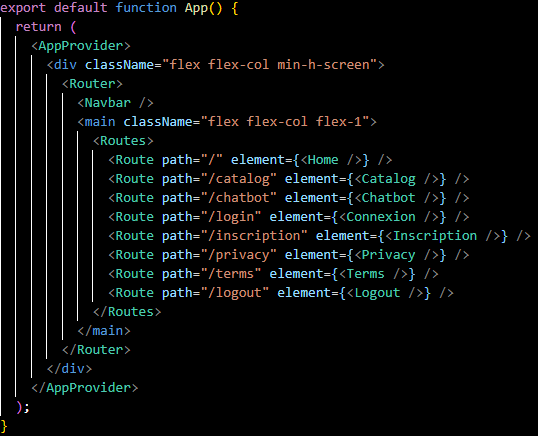

# RuneBook

RuneBook est une application web composée d’un backend API et d’un frontend React, avec une architecture moderne full-stack. Un site web pour comprendre les bases, les tactiques et l’esport sur League of legend avec l’aide de l’IA.

---

# 🧠 Architecture générale

L’application repose sur une architecture séparée :

- **Frontend** : React (Vercel)
- **Backend** : FastAPI (Render)
- **Base de données** : PostgreSQL (Supabase)
- **Base vectorielle** : Qdrant (Docker en local ou cloud Qdrant en ligne)
- **API communication** : REST



---

# ⚙️ Backend

## 🚀 Technologies utilisées

- **FastAPI** : création de l’API REST
- **SQLAlchemy** : ORM pour la gestion de la base de données PostgreSQL
- **Mistral** : API externe de LLM utilisé
- **HuggingFace** : API externe de génération d’embeddings à partir de texte

---

## 📦 Lancement en local (Windows)

```bash
python -m venv ./venv
.\venv\Scripts\activate
pip install -r .\requirements.txt
uvicorn backend.app:app --reload --host 127.0.0.1 --port 5000